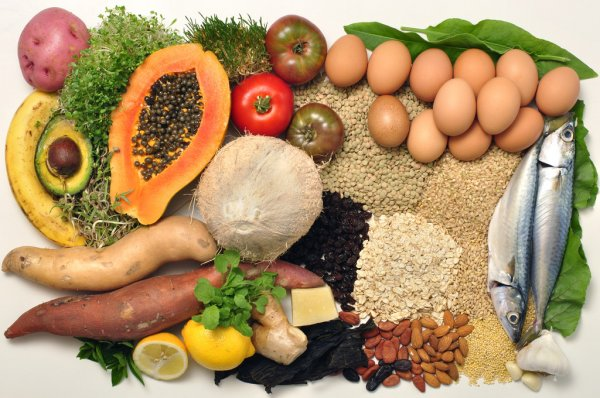

# Proyecto_APIS

RESUMEN: parto de un dataframe el cual me da información de alimentos y sus calorías por porción. Utilizo una API que me va a enriquecer la información inicial, ampliando con más datos de nutricionales de dichos alimentos. Para ello necesitaré limpiar todos los datos con los que cuento y utilizar los necesarios y requeridos para comprobar mis hipótesis, así como los disntintos métodos de comparación a utilizar.

HIPÓTESIS:
    1. El brócoli tiene menos azúcar que la coliflor pero más que la lechuga
    2. La patata tiene menos proteina y grasa total que el boniato

OTRAS COMPARATIVAS:
    1. Comparar la cantidad de colesterol de una serie de alimentos.
    2. Utilizar la columna health labels para obtener información concreta y extendida de alimentos.
    3. Comparativa de Calcio y Vitamina C de dos alimentos cualquiesquiera que me de el usuario.

--> Comienzo trabajando en un jupyter notebook de limpieza de datos:
En este, limpio el dataframe inicial y obtengo una lista de los alimentos contenidos en la columna Food, con la que trabajaré el resto del proyecto.
A continuación utlizo una API para enriquecer los datos de mi dataframe inicial, esta requiere 3 parámetros, 2 tokens y un ingrediente, en este caso, crearé una función para que introducir la lista de alimentos obtenida, en lugar de un solo ingrediente, y así conectaré mi dataframe con la información de la API.
Una vez obtenida esta información, generaré un dataframe con ella, al cual le incluyo una columna de ingredientes == a la lista de alimentos inicial.
Ahora cuento con dos dataframes que comparten una columna, por lo que puedo unirlos y acabar con la limpieza de mi dataframe final.

--> Continúo trabajando en un jupyter notebook para la visualización de los datos ya limpios.

OBJETIVO DEL PROYECTO: demostrar las hipótesis y comparativas indicadas inicialmente.

ESTRUCTURA DEL PROYECTO: 
    - Una carpeta data con el csv inicial y el csv enriquecido --> Food and Calories y Food_enriched.
    - Un documento jupyter de limpieza --> 1-dataset
    - Un docuemnto jupyter de visualizacion --> 1-visualization
    - Una carpeta gitignore
    - Una carpeta src con archivos de limpieza de código --> cleaning_functions y visualization.
    - Un archivo Readme
    - Un arhivo main.py que contiene todo el código de limpieza

BIBLIOGRAFÍA Y LIBRERÍAS USADAS:
 -https://www.kaggle.com/ (dataset).
 -https://https://api.edamam.com/api/nutrition-data (API).
    
        - Requests (https://docs.python-requests.org/en/latest/)
        - Numpy (https://numpy.org/doc/)
        - Os (https://docs.python.org/3/library/os.html)
        - Pandas (https://pandas.pydata.org/)
        - Load_dotenv (https://pypi.org/project/python-dotenv/)
        - Seaborn (https://seaborn.pydata.org/)
        - Matplotli.pyplot (https://matplotlib.org/stable/api/_as_gen/matplotlib.pyplot.html)
        - Plotly.express (https://plotly.com/python-api-reference/plotly.express.html)

CONCLUSIÓN FINAL:
Procedo a la compración de mis hipótesis, así como al resto de comparativas definidas inicialmente.

Hipótesis 1: Se refuta mi hipótesis ya que aunque el Brócoli tiene más azucar que la lechuga también tiene más azúcar que la coliflor, y deben cumplirse ambas condiciones.

Hipótesis 2: Se cumple mi hipótesis ya que la patata tiene menos proteínas y menos grasas totales que el boniato.

Comparativa 1. Compruebo que el alimento que más colesterol tiene de los alimentos comparados es "Bacon and Eggs" y el que menos "Nachos with Cheese".

Uso columna health labels. Para poder utilizar la columna health labels, la cual me da mucha información de cada alimento, hago un input a la columna, donde el usuario deberá introducir un alimento de los que están en la columna Food. La respuesta será una lista con toda la información almacenada de dicho alimento ingresado por el usuario. Se trata de un ejercicio meramente informativo.

Comparativa 2. Para que el usuario pueda comparar valores de dos alimentos o ingredientes cualesquiera contenidos en la lista Food del dataframe, creo una función que pida al usuario ambos ingredientes y me dará como resultado una gráfica, en este caso comparando los valores de Calcio y Vitamina C de cada uno.

